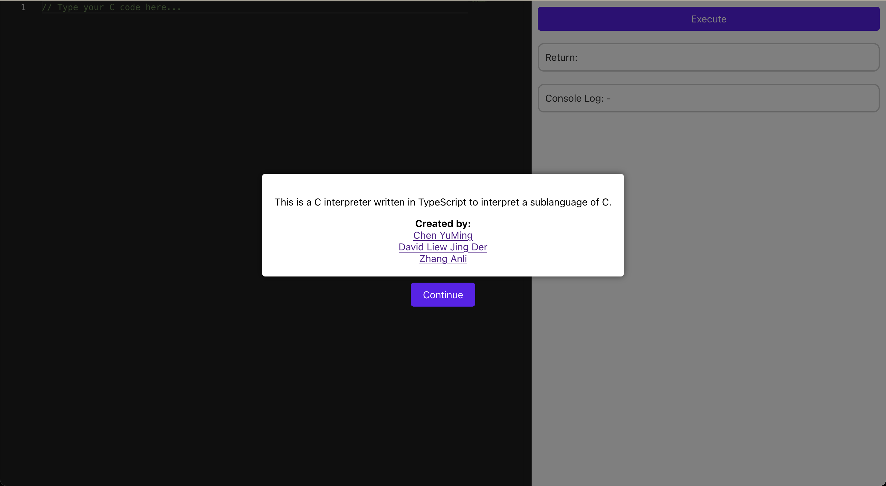
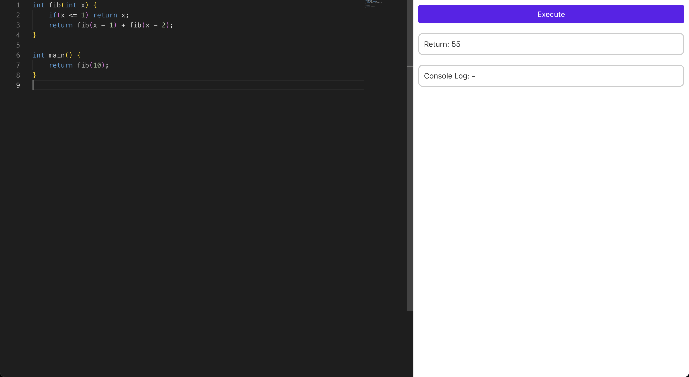

# Project Name: C Interpreter

This is a C interpreter written in TypeScript to interpret a sublanguage of C. The front end of this project is built using React.

## Setup

To set up this project on your local machine, follow the steps below:

### Backend

1. Navigate to the `backend/` directory using your terminal.
2. Run the command `npm install` to install the dependencies.
3. Run the command `npm start` to start the server.

### Frontend

1. Open another terminal window and navigate to the `frontend/` directory using your terminal.
2. Run the command `npm install` to install the dependencies.
3. Run the command `npm start` to start the React app.

The server will be running on `localhost:3000` and the React app will be running on `localhost:3002`.

## Usage

Once the server and React app are running, you can use the interpreter by navigating to `localhost:3002` in your browser.
You should be able to see the following page then click `Continue` to proceed:

To use the interpreter, follow the steps below:
1. Enter your C code in the code editor area on the left.
2. Click the `Execute` button to run the code.
3. The output will be displayed in the output area on the right.

Here is an example of the interpreter in action:

## Testing

There are multiple ways to test our interpreter.

### Running C Code on the Frontend

To test the interpreter on the frontend, follow these steps:

1. Set up the project by navigating to the `backend` and `frontend` directories and running `npm install`.
2. Run `npm start` in both the `backend` and `frontend` directories to start the server and the React app, respectively.
3. Input your C code in the code editor on the frontend.
4. Click the "Execute" button to observe the output.

### Running Tests on the Command Line

To run the interpreter tests on the command line interface, follow these steps:

1. Navigate to the `backend` directory using your terminal.
2. Put the C code you want to test inside `backend/test/main.c`.
3. Run the command `npm run clitest`.

### Running Individual Test Cases

We have also created test cases to test our interpreter. To run our test cases, follow the steps below:

1. Navigate to the `backend` directory using your terminal.
2. Run the command `npm test`.
3. You should see all the test cases pass.
4. To view individual test cases, navigate to the `backend/test/` directory and open the `test.ts` file.

## Team

This project is developed by the following team members:

- Chen YuMing
- David Liew Jing Der
- Zhang Anli
